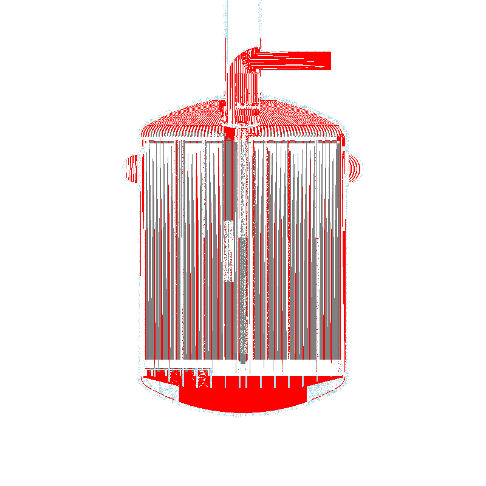
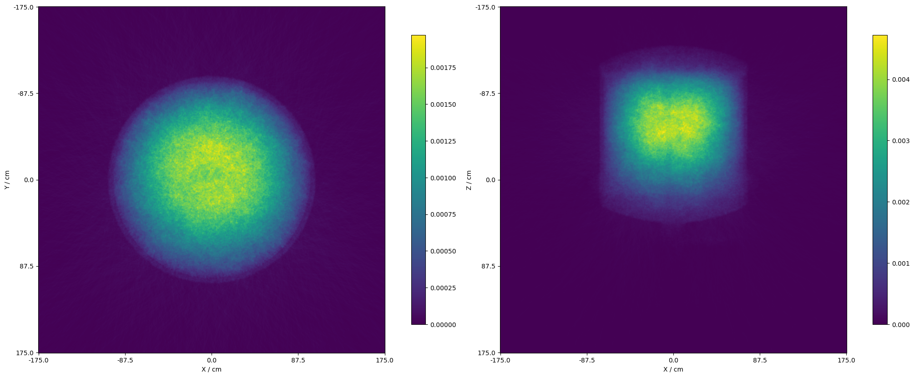
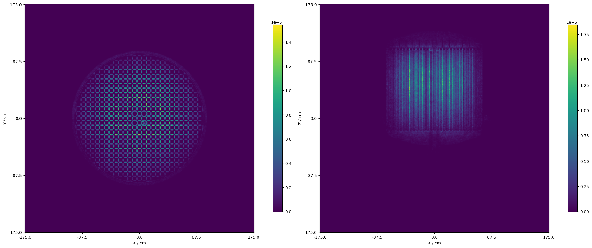
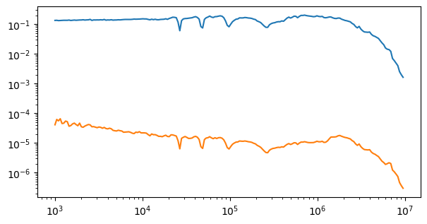
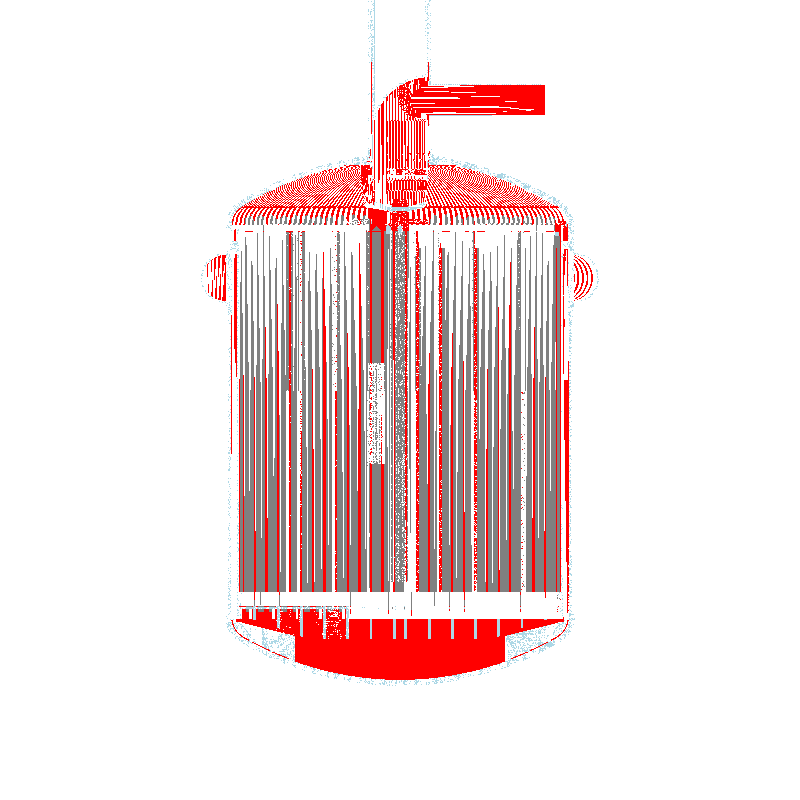
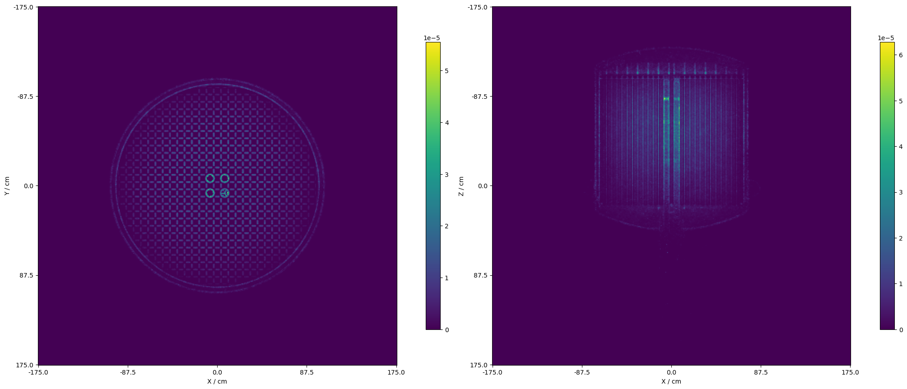

# MSRE Simulation Notebook

This notebook demonstrates the process of running calculations for the Molten Salt Reactor Experiment (MSRE) directly from a Computer-Aided Design (CAD) drawing. The model is generated from the original drawings obtained from Oak Ridge National Lab.

The simulation backend utilizes the Open Source Monte Carlo particle transport code OpenMC ([OpenMC Website](https://openmc.org)) through its Python interface.

## Materials Definition

The first step involves defining the materials that constitute the MSRE core. This includes materials like graphite, hastelloy, fuel salt, helium, inconel, and inor. The material properties and compositions are set accordingly.

```python
# Python code for materials definition

# ... (previous material definitions)

# Plot the geometry to verify
xwidth = 350
yheight = 350
material_colors = {salt: 'red', inor: 'lightblue', inconel: 'blue', helium: 'white', graphite: 'gray'}

# Create plots
p1 = openmc.Plot()
# ... (additional plot settings)

plots = openmc.Plots([p1, p2])
openmc.plot_inline(plots)
```

<p align="center">
  
</p>


## Geometry Definition

Next, the geometry of the MSRE core is defined using the DAGMCUniverse and exported to an XML file.

```python
# Python code for geometry definition

# ... (geometry definition code)

# Plot the geometry to verify
plots = openmc.Plots([p1, p2, p3])
openmc.plot_inline(plots)
```

<p align="center">
  
</p>


## Settings and Simulation

After defining materials and geometry, settings for the Monte Carlo simulation are specified. This includes neutron source definition, settings for the computation, and exporting to an XML file.

```python
# Python code for simulation settings

# ... (settings and source definition)

# Export settings to XML
settings = openmc.Settings()
settings.source = source
settings.batches = 20
settings.inactive = 5
settings.particles = 20000
settings.export_to_xml()

# Run the simulation
openmc.run()
```

## Data Extraction and Visualization

Post-simulation, data is extracted from the statepoint file to analyze neutron flux using tallies.

```python
# Python code for data extraction and visualization

# ... (data extraction code)

# Plot neutron flux maps
import matplotlib.pyplot as plt
import numpy as np
fig, (ax1, ax2) = plt.subplots(ncols=2, figsize=(20, 16), constrained_layout=True)

# ... (flux map plotting code)

# Similarly, plot fission reactions
# ... (fission map plotting code)

# Energy spectrum analysis
# ... (energy spectrum plotting code)
```

<p align="center">
  
</p>

<p align="center">
  
</p>

<p align="center">
  
</p>


## Control Rods and Modified Geometry

To account for control rods in the reactor model, modify the geometry file and add the corresponding materials. Then, run the simulation again.

```python
# Python code for control rods and modified geometry

# ... (geometry modification code)

# ... (materials modification code)

# Plot the modified geometry
plots = openmc.Plots([p1, p2, p3])
openmc.plot_inline(plots)

# Run the simulation with control rods
os.system("rm -f summary.h5 statepoint.20.h5")
openmc.run()
```

<p align="center">
  
</p>

<p align="center">
  
</p>

<p align="center">
  
</p>

<p align="center">
  
</p>


## Contact Information

For any inquiries or issues, please contact Elmer E. Alanoca C. at eealanoca@gmail.com.